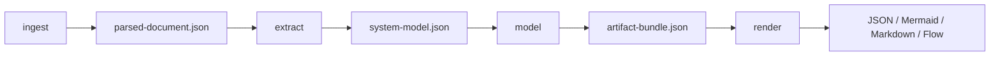
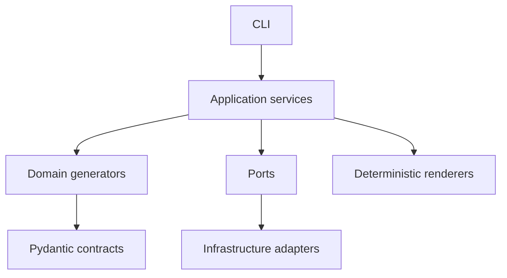

# Agent Threatmodeler

Python 3.12+ CLI that turns Architecture Review Board (ARB) material into a validated,
traceable threat model. It ingests local HTML/Markdown exports or Confluence pages,
extracts a canonical system model with an agent, generates JSON artifacts, and renders
deterministic views (JSON, Mermaid, Markdown, flow graphs).

Untrusted source text never becomes an artifact directly: everything passes through
Pydantic contracts and validation before persistence or rendering.

## Prerequisites

- Python 3.12+
- Virtual environment recommended
- Agent credentials for **`extract`** and **`model`** (see [Model providers](#model-providers))
- **`render`** only needs an existing `artifact-bundle.json`

### Install

Windows PowerShell:

```powershell
python -m venv .venv
.venv\Scripts\Activate.ps1
python -m pip install -e ".[dev]"
threatmodeler --help
```

macOS / Linux:

```shell
python -m venv .venv
source .venv/bin/activate
python -m pip install -e ".[dev]"
threatmodeler --help
```

## How to run

### Full pipeline

```shell
threatmodeler analyze \
  --input ./sample-arb.complex.html \
  --output ./out \
  --formats json,mermaid,markdown,flow
```

Runs: **ingest → extract → model → render**.

### Stage by stage

```shell
threatmodeler ingest --input ./sample-arb.html --output ./out
threatmodeler extract --input ./out/parsed-document.json --output ./out
threatmodeler model --input ./out/system-model.json --output ./out
threatmodeler render \
  --input ./out/artifact-bundle.json \
  --formats json,mermaid,markdown,flow \
  --output ./out/rendered
```

### Sample inputs

| File | Use |
| --- | --- |
| `sample-arb.html` | Small ARB; fast end-to-end |
| `sample-arb.full.html` | Full regression fixture |
| `sample-arb.complex.html` | Dense tables, many actors/flows (pair with `payments-runtime.complex.drawio`) |
| `payments-runtime.drawio` | Diagram for mini/full HTML |

### CLI flags

- `--debug` — show traceback on unexpected errors
- `--fail-on-missing-information` — fail extract/model/analyze when canonical gaps remain

### Output layout (after `analyze`)

```text
out/
├── parsed-document.json
├── system-model.json
├── stride-threats.json
├── risk-register.json
├── mitigation-plan.json
├── completeness-report.json
├── technical-report.json
├── artifact-bundle.json
├── journal/          # optional construction traces
└── rendered/
    ├── json/
    ├── mermaid/
    ├── markdown/
    └── flow/
```

Twenty-one JSON artifact files are written under the output directory; see `artifact-bundle.json` for the full graph.

## Workflow



| Stage | Command | Agent? | Main output |
| --- | --- | --- | --- |
| Ingest | `ingest` | No | `parsed-document.json` |
| Extract | `extract` | Yes | `system-model.json` |
| Model | `model` | Yes (STRIDE + downstream) | 21 JSON artifacts + bundle |
| Render | `render` | No | `rendered/` |

Deterministic steps include inventories, DFD projection, risk scoring shape, asset trust-level
cross-reference, completeness checks, and all renderers. Agent tool-calling builds STRIDE
threats, abuse cases, mitigations, reports, and related downstream artifacts.

## Architecture

Ports-and-adapters layout:



- **CLI** — Typer commands; composition root in `threatmodeler/cli/main.py`
- **Application** — ingest, extract, model, render, analyze workflows
- **Domain** — inventory, scoring, completeness, report assembly
- **Contracts** — canonical model and artifact schemas
- **Infrastructure** — Confluence, HTTP, agent clients, local filesystem
- **Renderers** — JSON, Mermaid, Markdown, flow (no agent calls)

## Model providers

Set `THREATMODELER_AGENT_PROVIDER_NAME` to one of:

| Provider | Value | Notes |
| --- | --- | --- |
| OpenAI | `openai` | `THREATMODELER_OPENAI_API_KEY` or `THREATMODELER_AGENT_API_KEY` |
| Azure OpenAI | `azure` / `azure_openai` | `THREATMODELER_AZURE_OPENAI_API_KEY`, `THREATMODELER_AZURE_OPENAI_ENDPOINT` |
| GitHub Copilot | `github_copilot` / `copilot` | `github-copilot-sdk`; run `python -m copilot download-runtime` once |

Copilot auth: signed-in Copilot CLI / `gh`, or `THREATMODELER_GITHUB_TOKEN`.

Remote Confluence ingest (optional):

```powershell
$env:THREATMODELER_CONFLUENCE_BASE_URL = "https://your-site.atlassian.net"
$env:THREATMODELER_CONFLUENCE_USER_EMAIL = "you@example.com"
$env:THREATMODELER_CONFLUENCE_API_KEY = "your-token"
threatmodeler ingest --input "123456" --output ./out
```

### Common environment variables

| Variable | Default | Purpose |
| --- | --- | --- |
| `THREATMODELER_AGENT_PROVIDER_NAME` | `openai` | Provider selection |
| `THREATMODELER_AGENT_MODEL_NAME` | `agent-model` | Model/deployment name |
| `THREATMODELER_AGENT_JOURNAL_ENABLED` | `true` | Write `journal/` under output |
| `THREATMODELER_FAIL_ON_MISSING_INFORMATION` | `false` | Block on architecture gaps |
| `THREATMODELER_LOG_LEVEL` | `INFO` | Logging verbosity |

Full list: `threatmodeler/config/settings.py`.

## Development

```shell
make quality
```

Or individually: `make format`, `make lint`, `make typecheck`, `make test`.

Tests block network access by default; integration tests use mocked agents under `tests/integration/`.
